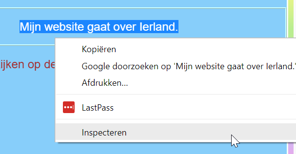
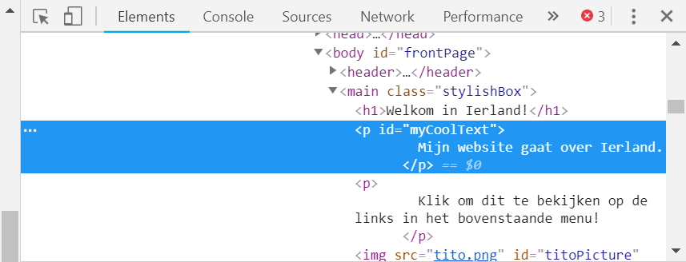
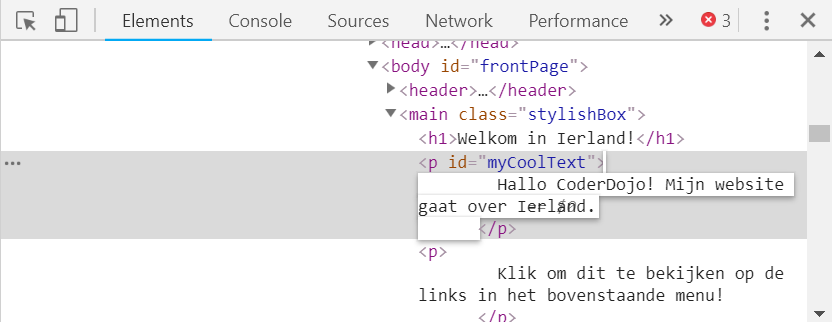
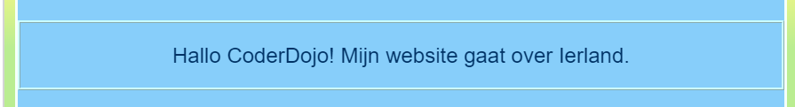
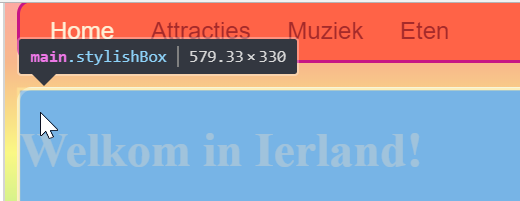
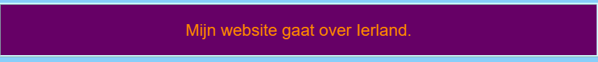

## Bekijk de code van andere websites!

**Opmerking:** Om deze stap te voltooien, moet je een van deze webbrowsers gebruiken: Chrome, Firefox of Internet Explorer/Edge. Als je geen toegang hebt tot een van deze webbrowsers, kun je gewoon doorgaan naar de volgende kaart.

Op deze kaart leer je hoe je een kijkje kunt nemen in de code van een website met behulp van de **inspectie-tool**, en je zult ook ontdekken hoe je enkele wijzigingen kunt aanbrengen die alleen jij kunt zien!

+ Zorg ervoor dat voordat je begint je project is opgeslagen. Vernieuw vervolgens je website door op het vernieuwingspictogram in je browser te klikken.

+ Op je webpagina (de eigenlijke pagina, niet de code) markeer je de tekst met rand die je op de vorige kaart hebt toegevoegd, klik er met de rechtermuisknop op en selecteer de optie **Inspecteren** vanuit het menu dat verschijnt. (De optie kan 'Inspect Element' of iets dergelijks worden genoemd, afhankelijk van welke browser je gebruikt. Als je problemen ondervindt bij het vinden van de menuoptie, vraag je gewoon iemand bij jouw dojo om hulp.)



Er verschijnt een heel nieuw vak in je webbrowser met veel tabbladen en code: de **ontwikkelaarstools**, of **dev-tools** in het kort. Hier kunt je de code zien voor het gedeelte die je gemarkeerd hebt, maar ook de code voor de hele pagina!

### Doornemen van de HTML-code

+ Zoek naar het tabblad met de HTML-code voor de pagina (dit kan 'Elements' of 'Inspector' worden genoemd). De code moet er ongeveer hetzelfde uitzien als hoe je deze in jouw HTML-bestand hebt getypt! Je kunt op de kleine driehoekjes aan de linkerkant van het vak klikken om de verborgen code uit te vouwen.



+ Dubbelklik op de tekst tussen de tags. Je zou het nu moeten kunnen bewerken! Typ iets in en druk op <kbd>Enter</kbd>.



+ Zie je de tekst veranderen op je website? Opmerking: alleen jij kunt deze wijzigingen zien.



+ Nu **reload** (herlaad) de pagina en kijk wat er gebeurt. Je wijzigingen moeten verdwijnen!

+ Klik in de linkerbovenhoek van het vak op het pictogram dat lijkt op een kleine rechthoek met een pijl. Nu kunt je de cursor over de webpagina bewegen en de HTML-inspecteur toont je de code die deze beschrijft.

 

### Doornemen van de CSS code

+ Laten we vervolgens eens de CSS-code bekijken. Zoek naar de **Styles** tab in de ontwikkelaartools (dit kan 'Style Editor' of iets dergelijks worden genoemd). Je zou een aantal CSS regels moeten zien, inclusief degene die je voor die alinea hebt gemaakt, `#myCoolText`.


+ In de `#myCoolText` regels, klik op de waarde naast de `color` eigenschap. Probeer een andere waarde in te typen. Kijk hoe de tekst op je webpagina van kleur verandert! 


Opmerking: je kunt ook op het gekleurde vierkant klikken om de kleur te wijzigen met behulp van een gereedschap voor kleurkiezers.

+ Klik op de spatie achter de kleur. Er begint een nieuwe regel, waarin je meer CSS kunt typen. Typ het volgende en druk op <kbd>Enter</kbd>:

```css
  background-color: #660066;
```

Je zou de achtergrond van dat stuk tekst moeten zien veranderen.

 

## \--- collapse \---

## title: Hoe werkt het?

Wanneer je de websitecode wijzigt met de ontwikkelaar-tools, verander je **tijdelijk** datgene wat je **in je browser ziet**. Je verandert eigenlijk niet de bestanden waaruit de website bestaat.

Wanneer je de pagina vernieuwt, laad je de website opnieuw in vanuit de bestanden (vanaf internet of je computer). Dat is waarom je veranderingen verdwijnen.

Nu je dat weet, kun je leuke dingen doen met de code op andere websites!

\--- /collapse \---

+ Probeer deze tools te gebruiken om de code op een andere website te bekijken. Je kunt zelfs wijzigingen aanbrengen als je wilt! Vergeet niet dat alleen jij de wijzigingen kunt zien die je aanbrengt en dat alles wordt gereset wanneer je de pagina vernieuwt.