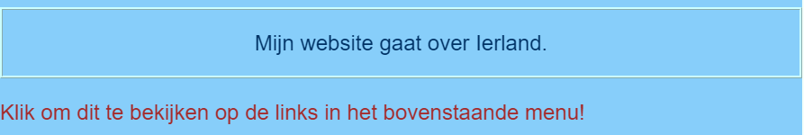

## Eigen stijl

Laten we de startpagina een beetje opleuken! Met een ander soort CSS selector kun je een unieke set CSS regels toepassen op slechts **een specifiek element**.

+ Ga naar `index.html` en zoek een alinea (`p`) element, of voeg er een toe als je er geen hebt. Voeg het volgende **attribute** toe aan de tag:

```html
    <p id="myCoolText"> 
       Mijn website gaat over Ierland.
    </p> 
```

De `id` is een naam die je een bepaald element geeft om deze te **identificeren**). Twee elementen op dezelfde pagina mogen nooit dezelfde `id` hebben!

+ Ga nu naar je style sheet en voeg de volgende code toe:

```css
    #myCoolText {
        color: #003366;
        border: 2px ridge #ccffff;
        padding: 15px;
        text-align: center;
    }
```

Je tekst zou er nu als volgt uit moeten zien:



Een selector met een `#` ervoor wordt gebruikt om CSS regels aan een specifiek element op je website toe te wijzen. Je specificeert het element met behulp van de naam waaraan je het `id` attribuut hebt toegewezen.

+ Laten we er een doen voor de `body` van de home page. Ga naar `index.html` en voeg een `id` toe aan de `body` tag.

```html
    <body id="frontPage">
```

+ In the style sheet, add the following CSS rules:

```css
    #frontPage {
        background: #48D1CC;
        background: linear-gradient(#fea3aa, #f8b88b, #faf884, #baed91, #baed91, #b2cefe, #f2a2e8, #fea3aa);
    }
```

You should get something that looks like this:


You just used a **gradient**! That's the name given to the effect where one colour fades into another. Note: The first `background` property above the gradient one determines a default colour for browsers that don't support gradients.

If you typed the code perfectly and you didn't get the lovely rainbow effect above, it could be that your browser doesn't support gradients.

You can make lots of different effects with gradients. If you want to learn more, go [here](http://dojo.soy/html2-css-gradients){:target="_blank"}.

\--- challenge \---

## Challenge: style some more elements

+ Try giving another element an `id` and styling that element using the ID selector with a `#` as above. How about making one picture have a `border-radius` of `100%` so that it's fully rounded? Any other pictures on the website will stay the same as they are. 

\--- hints \---

\--- hint \---

You give an element an `id` by adding the `id` attribute to the HTML tag, like this:

```html
          
```

Choose any `id` name you like.

\--- /hint \---

\--- hint \---

To define style rules for a specific element, you use the `#` symbol, and the name that you gave the element as its `id`.

```css
  #titoPicture {
    border-radius: 100%;
  }
```

Note: the name you type in front of the CSS rules should **exactly** match the name you put in the element's `id` attribute.

\--- /hint \---

\--- /hints \---


\--- /challenge \---