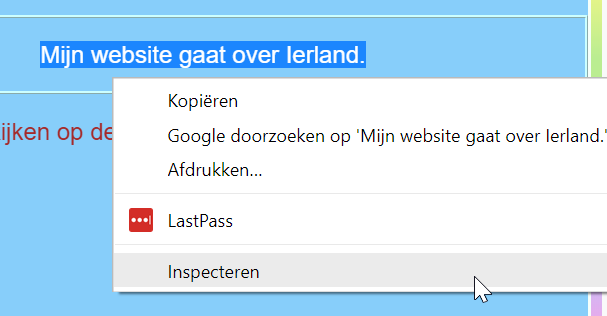
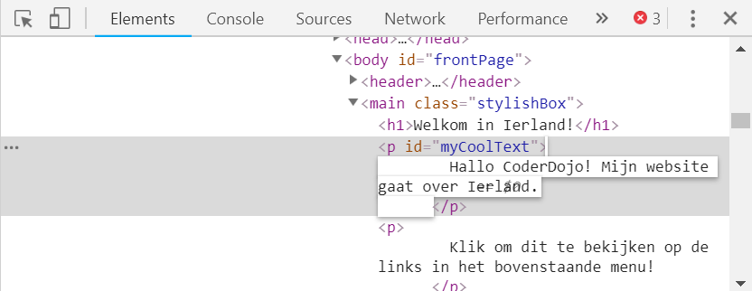
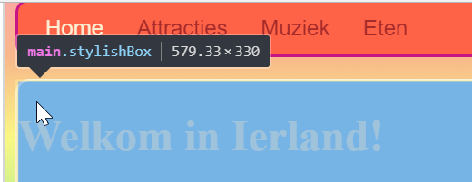
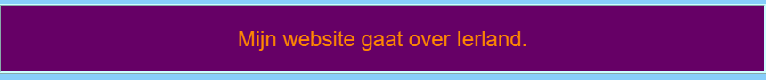

## Bekijk de code van andere websites!

**Opmerking:** Om deze stap te voltooien, moet je een van deze webbrowsers gebruiken: Chrome, Firefox of Internet Explorer/Edge. Als je geen toegang hebt tot een van deze webbrowsers, kun je gewoon doorgaan naar de volgende kaart.

Op deze kaart leer je hoe je een kijkje kunt nemen in de code van een website met behulp van de **inspectie tool**, en je zult ook ontdekken hoe je enkele wijzigingen kunt aanbrengen die alleen jij kunt zien!

+ Zorg ervoor dat voordat je begint je project is opgeslagen. Vernieuw vervolgens je website door op het vernieuwingspictogram in je browser te klikken.

+ Op je webpagina (de eigenlijke pagina, niet de code) markeer je de tekst met rand die je op de vorige kaart hebt toegevoegd, klik er met de rechtermuisknop op en selecteer de optie **Inspecteren** vanuit het menu dat verschijnt. (De optie kan 'Inspect Element' of iets dergelijks worden genoemd, afhankelijk van welke browser je gebruikt. Als je problemen ondervindt bij het vinden van de menuoptie, vraag je gewoon iemand bij jouw Dojo om hulp.)



Er verschijnt een heel nieuw vak in je webbrowser met veel tabbladen en code: de **ontwikkelaarstools**, of **dev-tools** in het kort. Hier kunt je de code zien voor het gedeelte die je gemarkeerd hebt, maar ook de code voor de hele pagina!

### Doornemen van de HTML-code

+ Zoek naar het tabblad met de HTML-code voor de pagina (dit kan 'Elements' of 'Inspector' worden genoemd). De code moet er ongeveer hetzelfde uitzien als hoe je deze in jouw HTML-bestand hebt getypt! Je kunt op de kleine driehoekjes aan de linkerkant van het vak klikken om de verborgen code uit te vouwen.


+ Dubbelklik op de tekst tussen de tags. Je zou het nu moeten kunnen bewerken! Typ iets in en druk op <kbd>Enter</kbd>.



+ Zie je de tekst veranderen op je website? Opmerking: alleen jij kunt deze wijzigingen zien.


+ Nu **reload** (herlaad) de pagina en kijk wat er gebeurt. Je wijzigingen moeten verdwijnen!

+ Klik in de linkerbovenhoek van het vak op het pictogram dat lijkt op een kleine rechthoek met een pijl. Nu kunt je de cursor over de webpagina bewegen en de HTML-inspecteur toont je de code die deze beschrijft.

 

### Doornemen van de CSS code

+ Laten we vervolgens eens de CSS-code bekijken. Zoek naar de **Styles** tab in de ontwikkelaartools (dit kan 'Style Editor' of iets dergelijks worden genoemd). Je zou een aantal CSS regels moeten zien, inclusief degene die je voor die alinea hebt gemaakt, `#myCoolText`.


+ In de `#myCoolText` regels, klik op de waarde naast het `color` eigendom. Probeer een andere waarde in te typen. Kijk hoe de tekst op je webpagina van kleur verandert! 


Note: you can also click the coloured square to change the colour using a colour picker tool.

+ Click in the space after the colour. A new line starts, where you can type more CSS. Type the following and press <kbd>Enter</kbd>:

```css
  background-color: #660066;
```

You should see the background change on that piece of text.

 

## \--- collapse \---

## title: How does it work?

When you change website code using the developer tools, you are **temporarily** changing what it looks like **in your browser**. You aren't actually changing the files that make up the website.

When you refresh the page, you are loading up the website again from its files (on the internet or on your computer). That's why your changes disappear.

Now that you know that, you can have some fun messing with the code on other websites!

\--- /collapse \---

+ Try using these tools to look at the code on another website. You can even make changes if you like! Remember, only you can see the changes you make, and everything will reset when you refresh the page.