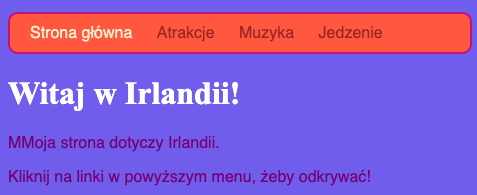
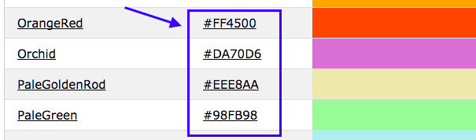

## Wszystkie kolory!

Jak widziałeś wcześniej, możesz wpisać wiele różnych nazw kolorów jako słowa, a przeglądarka je rozpozna. Ale bardziej powszechnym sposobem na ustawianie kolorów jest używanie czegoś o nazwie **kody szesnastkowe** (to specjalny sposób liczenia w układzie szesnastkowym).

+ Spójrz na swój **arkusz stylów**. To plik który ma w nazwie `.css`.

+ Wewnątrz reguł CSS dla `body`, ustaw kod szesnastkowy koloru tła na `#7B68EE`:

```html
  background-color: #7B68EE;
```

Uwaga: Jeśli używasz komputera Mac, możesz wpisać `#` naciskając jednocześnie klawisze <kbd>alt</kbd> i <kbd>3</kbd>.

Twoja witryna powinna mieć teraz fioletowe tło.




+ Nie jesteś fanem fioletu? Przejdź do [tej strony](http://dojo.soy/html2-colors){:target="_blank"} i wybierz inny kolor arkusza stylów — zamiast wpisywać nazwę koloru, wpisz kod szesnastkowy. 



Kody kolorów pozwalają na utworzenie dowolnego koloru, nawet jeśli nie znajduje się on na żadnej liście kolorów.

+ Spróbuj utworzyć własny kod koloru. Musi się on zaczynać od `#`. To mówi przeglądarce, że jest to kod szesnastkowy, zamiast nazwy koloru. Pozostała część kodu składa się z sześciu znaków. Mogą to być dowolne cyfry od **0 do 9** oraz wszystkie litery od **A do F**.

--- collapse ---
---
title: Jak to działa?
---

Każdy kolor powstaje poprzez zmieszanie różnych ilości **czerwonego**, **zielonego** oraz **niebieskiego**. Jest to zapis **RGB**. Każdy z tych kolorów jest reprezentowany dwoma z sześciu cyfr w kodzie szesnastkowym. `00` to minimum, a `FF` to maksimum.

**Układ szesnastkowy** to sposób liczenia, który sprawia, że liczby są krótsze w zapisie, używając liter od A do F jako dodatkowych cyfr. Liczbę `255` zapisuje się w układzie szesnastkowym jako `FF`. Nie musisz się martwić o naukę liczenia za pomocą liczb w układzie szesnastkowym. Zamiast tego, eksperymentuj z różnymi kodami szesnastkowymi, aby się do nich przyzwyczaić.

+ Oto kilka podstawowych kolorów, które możesz wypróbować na swojej stronie. Spróbuj umieścić mniejsze liczby zamiast `FF` aby zobaczyć, jak zmieniają się odcienie.

|      | R  | G  | B  |       Wynik        |
| ---- | -- | -- | -- |:------------------:|
| \# | FF | 00 | 00 |      Czerwony      |
| \# | 00 | FF | 00 |      Zielony       |
| \# | 00 | 00 | FF |     Niebieski      |
| \# | FF | FF | 00 |       Żółty        |
| \# | FF | 00 | FF |      Magenta       |
| \# | 00 | FF | FF |       Cyjan        |
| \# | FF | 8c | 00 | Ciemnopomarańczowy |

--- /collapse ---

Uzyskanie idealnego koloru może wymagać wielu eksperymentów. Na szczęście istnieje wiele internetowych narzędzi do wybierania kolorów, które pomagają uzyskać kod szesnastkowy dla dowolnego koloru.


+ Wypróbuj [ten selektor kolorów](http://dojo.soy/html2-color-picker){:target="_blank"} i wybierz jakieś szesnastkowe kody kolorów do użycia dla pozostałych stylów na Twojej stronie.