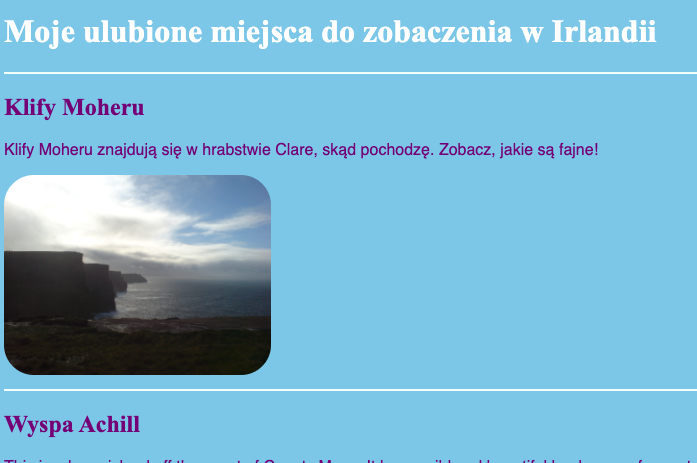

## Zaprojektuj swój motyw

Pisanie reguł CSS dla elementów takich jak `section` i `p` jest świetne, Ale co jeśli chcesz sprawić, by niektóre z nich wyglądały inaczej niż inne? Nauczysz się, jak stosować różne zestawy reguł stylu do elementów tego samego typu i stworzyć inny szablon dla każdej strony na swojej stronie internetowej!

+ Przejdź do pliku arkusza stylów i dodaj następujące - upewnij się, że kropka jest umieszczona z przodu!

```css
  .topDivider {
    border-top-style: solid;
    border-top-width: 2px;
    border-top-color: #F5FFFA;
    padding-bottom: 10px;
  }
```

+ Teraz przejdź do `attractions.html` (lub pliku HTML, nad którym pracujesz, jeśli korzystasz z własnego projektu) i dodaj następujący **atrybut** do każdego tagu `section`:

```html
  <section class="topDivider">
```

Powinieneś zobaczyć linię nad każdą sekcją na stronie. Gratulacje — właśnie użyłeś swojej pierwszej **klasy CSS**!



+ Spójrz na to, jak wygląda Twoja strona internetowa teraz i porównaj ją z innymi stronami posiadającymi elementy `section`. Zobaczysz, że tylko te, w których dodałaś atrybut `class="topDivider"` będą miały linię na górze.

--- collapse ---
---
title: Jak to działa?
---

Pamiętaj, że gdy używasz **selektora** CSS takiego jak `section` lub `p` lub `nav ul`, reguły stylu dotyczą **wszystkich** elementów tego typu na twojej stronie.

Dzięki **klasom** CSS, możesz zmienić styl tylko **niektórych** elementów.

Umieszczenie kropki przed selektorem powoduje, że staje się on **selektorem klasy**. Klasa może mieć jakąkolwiek nazwę, więc nie musi być nazwą elementu HTML. Na przykład:

```css
  .myAwesomeClass {
    /* moje fajne reguły stylu będą umieszczone tutaj */
}
```

Aby wybrać, do których elementów odnoszą się reguły stylu, dodajesz `atrybut` **klasy** do tych elementów w kodzie HTML: umieść nazwę klasy jako wartość atrybutu, **bez kropki** jak ten:

```html
  class="myAwesomeClass"
```

--- /collapse ---

+ Gotowy do wypróbowania innej klasy? Dodaj następujący kod CSS do `styles.css`:

```css
  .stylishBox {
    background-color: #87CEFA;
    color: #A52A2A;
    border-style: solid;
    border-width: 2px;
    border-color: #F5FFFA;
    border-radius: 10px;
  }
```

+ Następnie na innej stronie swojej witryny dodaj klasę do niektórych elementów. Dodam go do `sekcji` elementów na stronie Jedzenie w mojej witrynie, w ten sposób: `< section class="stylishBox">`.

Wygląda to świetnie, ale teraz moje sekcje są ściśnięte razem.


Możesz zastosować tyle klas CSS do elementu, ile chcesz. Wystarczy wpisać nazwy wszystkich klas, których chcesz użyć wewnątrz atrybutu `class` (pamiętaj, bez kropki!), oddzielając je spacjami.

+ Zróbmy kolejną klasę CSS, aby dać sekcjom pewien margines i wypełnienie. W pliku `styles.css` utwórz następującą klasę CSS:

```css
  .someSpacing {
    padding: 10px;
    margin-top: 20px;
  }
```

+ W swoim kodzie `html` dodaj nową klasę do każdego z elementów, nad którymi pracowałeś:

```html
  <section class="stylishBox someSpacing">
```


Klasy CSS pozwalają więc **wybrać** które elementy stylizować, i pozwalają Ci **ponownie użyć** tego samego zestawu reguł stylu na dowolnych elementach, które chcesz.

+ Przejdź do `index.html` i dodaj klasę `stylishBox` do elementu `main` lub innego elementu na stronie. Możesz go później usunąć ponownie!

```html
    <main class="stylishBox">   
```

Oto jak wygląda moja strona z klasą CSS. Dodałem również klasę `topDivider` do tagu `img` obrazkiem Tito.


--- challenge ---

## Wyzwanie: zrób nowe klasy

+ Użyj **classes** CSS aby zdefiniować kilka różnych rozmiarów zdjęć dla swojej strony internetowej, na przykład `.smallPictures` i `.mediumPictures`. Następnie usuń atrybut `width` z każdego z elementów `img` i zamiast tego dodaj odpowiednią klasę.

--- hints ---

--- hint ---

Możesz stworzyć klasę CSS, która definiuje tylko szerokość elementu takiego jak ten:

```css
  .smallPictures {
    width: 100px;
  }
```

--- /hint ---

--- hint ---

Oto tag `img` z atrybutem `width`:

```html
         
```

Po usunięciu atrybutu `width` i kontroli rozmiaru za pomocą klasy CSS wygląda tak:

```html
         
```

Używając klasy CSS, możesz łatwo zmienić szerokość wszystkich zdjęć jednocześnie, zmieniając tylko jedną linię kodu w arkuszu stylów!

--- /hint ---

--- /hints ---

--- /challenge ---