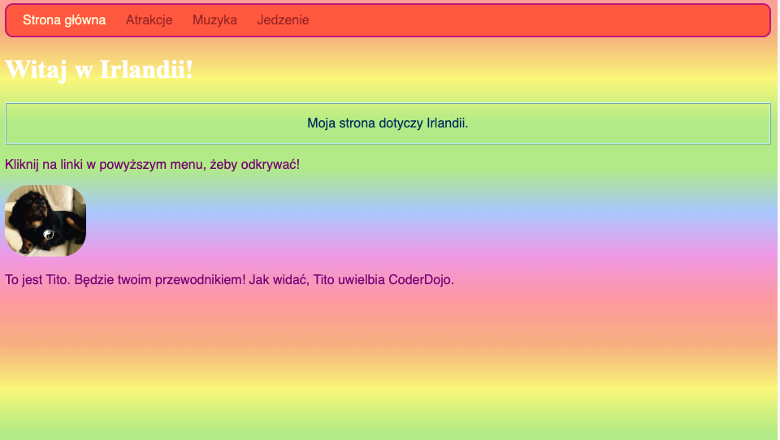

## Indywidualny styl

Ulepszmy nieco stronę główną! Za pomocą innego rodzaju selektora CSS możesz zastosować unikalny zestaw reguł CSS tylko do **jednego określonego elementu**.

+ Przejdź do `index.html` i znajdź akapit (`p`) lub dodaj jeden, jeśli nie masz żadnego. Dodaj następujący **atrybut** do tagu:

```html
    <p id="myCoolText">
        Moja strona internetowa dotyczy Irlandii.
    </p> 
```

`id` to nazwa, którą nadasz konkretnemu elementowi w celu jego **identyfikacji**. Żadne dwa elementy na stronie nie powinny mieć tego samego `id`!

+ Teraz przejdź do arkusza stylów i dodaj następujący kod:

```css
    #myCoolText {
        color: #003366;
        border: 2px ridge #ccffff;
        padding: 15px;
        text-align: center;
    }
```

Twój tekst powinien teraz wyglądać tak:


Selektor z `#` przed nim jest używany do stosowania reguł CSS do jednego konkretnego elementu na twojej stronie. Określasz element z pomocą nazwy, którą przypisałeś elementowi `id`.

+ Zróbmy jeden dla `body` strony głównej. Przejdź do `index.html` i dodaj `id` do znacznika `body`.

```html
    <body id="frontPage">
```

+ W arkuszu stylów dodaj następujące reguły CSS:

```css
    #frontPage {
        background: #48D1CC;
        background: linear-gradient(#fea3aa, #f8b88b, #faf884, #baed91, #baed91, #b2cefe, #f2a2e8, #fea3aa);
    }
```

Powinieneś dostać coś, co wygląda tak:



Właśnie użyłeś **gradientu**! To jest nazwa nadana efektowi, w którym jeden kolor przenika do drugiego. Uwaga: Pierwsza właściwość `background` nad gradientem określa domyślny kolor przeglądarki, która nie obsługuje gradientów.

Jeśli wpiszesz kod perfekcyjnie i nie uzyskasz powyższego efektu pięknej tęczy, być może Twoja przeglądarka nie obsługuje gradientów.

Za pomocą gradientów możesz tworzyć wiele różnych efektów. Jeśli chcesz dowiedzieć się więcej, przejdź [tutaj](http://dojo.soy/html2-css-gradients){:target="_blank"}.

\--- challenge \---

## Wyzwanie: stylizuj więcej elementów

+ Spróbuj nadać innemu elementowi `id` i stylizować ten element używając selektora ID z `#` jak powyżej. Co powiesz, żeby zrobić tak, aby jedno zdjęcie miało `border-radius` `100%`, aby było w pełni zaokrąglone? Wszelkie inne zdjęcia na stronie internetowej pozostaną takie same. 

\--- hints \---

\--- hint \---

Nadajesz elementowi `id` poprzez dodanie atrybutu `id` do tagu HTML, jak poniżej:

```html
          
```

Wybierz dowolną nazwę `id`, taką jaką chcesz.

\--- /hint \---

\--- hint \---

Aby zdefiniować reguły stylu dla konkretnego elementu, używasz symbolu `#` oraz nazwy, którą nadałeś elementowi jako `id`.

```css
  #titoPicture {
    border-radius: 100%;
  }
```

Uwaga: nazwa, którą wpisujesz przed regułami CSS powinna **dokładnie** odpowiadać nazwie podanej w atrybucie elementu `id`.

\--- /hint \---

\--- /hints \---


\--- /challenge \---