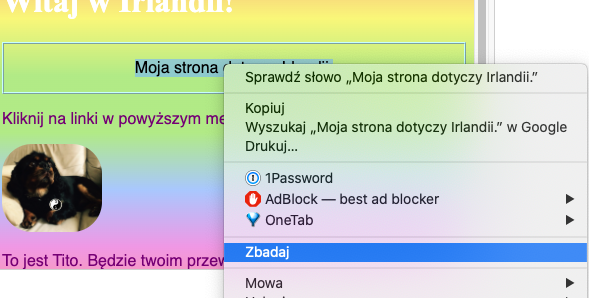
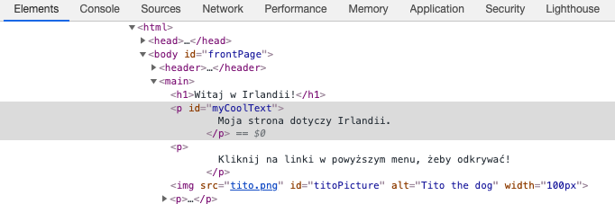
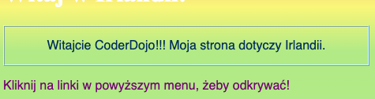
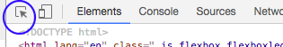
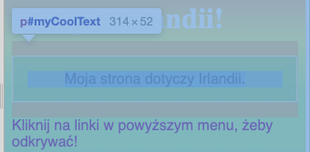

## Podglądaj kod innych stron internetowych!

**Uwaga:** Aby zakończyć ten krok, musisz użyć jednej z tych przeglądarek internetowych: Chrome, Firefox lub Internet Explorer/Edge. Jeśli nie masz dostępu do jednego z nich, możesz po prostu przejść do następnej karty.

Na tej karcie dowiesz się, jak podglądnąć na kod dowolnej witryny za pomocą **narzędzia inspektora**, a także dowiesz się, jak wprowadzić zmiany, które tylko Ty możesz zobaczyć!

+ Przed rozpoczęciem upewnij się, że projekt został zapisany. Następnie odśwież stronę, klikając ikonę odświeżania w przeglądarce.

+ Na swojej stronie internetowej (rzeczywistej stronie, a nie w kodzie) zaznacz tekst z ramką dodaną do poprzedniej karty, a następnie kliknij go prawym przyciskiem myszy i wybierz opcję **Sprawdź** z wyświetlonego menu. (Opcja może być nazywana 'Sprawdź element' lub podobnie, w zależności od tego, której przeglądarki używasz. Jeśli masz problem ze znalezieniem opcji menu, poproś o pomoc kogoś w Dojo.)



W przeglądarce pojawi się zupełnie nowe okno z dużą ilością zakładek i kodu: **developer tools** lub w skrócie **dev tools**. Tutaj możesz zobaczyć kod dla tego, co kliknąłeś, a także kod dla całej strony!

### Sprawdzanie kodu HTML

+ Poszukaj karty, która pokazuje kod HTML strony (może się nazywać „Elementy” lub „Inspektor”). Kod powinien wyglądać mniej więcej tak, jak wpisałeś go w pliku HTML! Możesz kliknąć małe trójkąty po prawej stronie, aby rozwinąć ukryty kod.



+ Kliknij dwukrotnie tekst pomiędzy znacznikami. Powinieneś być w stanie go teraz edytować! Wpisz coś i naciśnij <kbd>Enter</kbd>.


+ Czy widzisz aktualizację tekstu na swojej stronie? Uwaga: tylko Ty możesz zobaczyć te zmiany.



+ Teraz **odśwież** stronę i zobacz, co się stanie. Twoje zmiany powinny zniknąć!

+ W lewym górnym rogu okna narzędzi deweloperskich kliknij ikonę, która wygląda jak mały prostokąt ze strzałką. Teraz możesz przesunąć kursor na stronę internetową, a inspektor HTML wyświetli kod opisujący go.

 

### Sprawdzanie kodu CSS

+ Przyjrzyjmy się następnie kodowi CSS. Szukaj zakładki **Style** w narzędziach deweloperskich (może to być "Edytor stylów" lub podobne). Powinieneś zobaczyć kilka reguł CSS, w tym te, które stworzyłeś dla tego akapitu, `#myCoolText`.


+ W regułach `#myCoolText` kliknij wartość obok właściwości `color`. Spróbuj wpisać inną wartość. Zobacz, jak tekst na stronie zmienia kolor! 


Uwaga: możesz również kliknąć na kolorowy kwadrat, aby zmienić kolor za pomocą narzędzia do wybierania kolorów.

+ Kliknij w przestrzeń za kolorem. Rozpocznie się nowa linia, w której możesz wpisać więcej CSS. Wpisz poniższy tekst i naciśnij <kbd>Enter</kbd>:

```css
  background-color: #660066;
```

Powinieneś zobaczyć zmianę tła w tym fragmencie tekstu.

 

--- collapse ---
---
title: Jak to działa?
---

Gdy zmieniasz kod strony używając narzędzi deweloperskich, zmieniasz **tymczasowo** jak strona wygląda **w przeglądarce**. W rzeczywistości nie zmieniasz plików tworzących witrynę.

Kiedy odświeżysz stronę, ponownie ładujesz witrynę z jej plików (w Internecie lub na komputerze). Dlatego twoje zmiany znikają.

Teraz, gdy już to wiesz, możesz bawić się z kodem na innych stronach internetowych!

--- /collapse ---

+ Spróbuj użyć tych narzędzi, aby zobaczyć kod na innej stronie internetowej. Możesz nawet wprowadzić zmiany, jeśli chcesz! Pamiętaj, że tylko Ty widzisz dokonane zmiany, a wszystko zresetuje się po odświeżeniu strony.