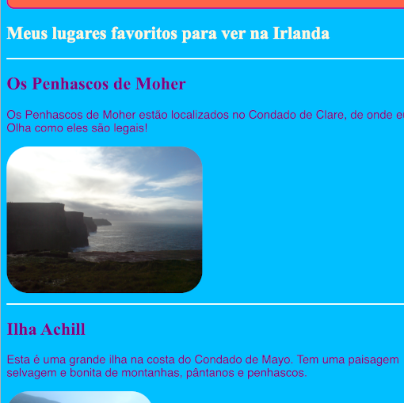
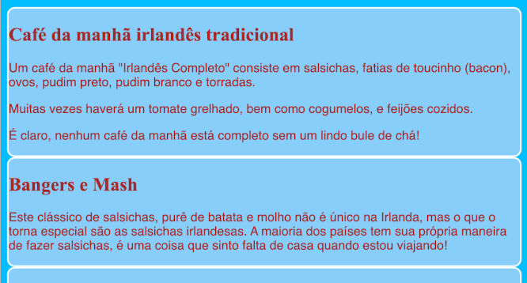
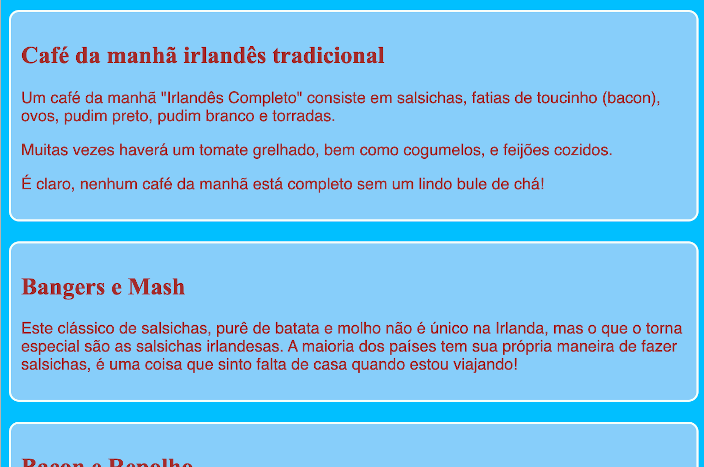
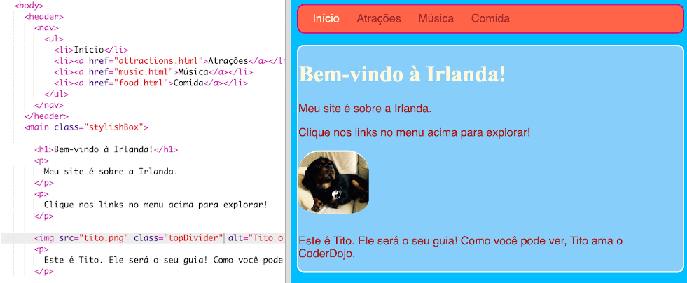

## Crie alguns temas

Escrevendo regras CSS para elementos como `section` e `p` é ótimo, mas e se você quiser fazer com que alguns pareçam diferentes dos outros? Neste cartão, você aprenderá como aplicar diferentes conjuntos de regras de estilo a elementos do mesmo tipo e criar um tema diferente para cada página do seu site!

+ Vá para o arquivo da folha de estilos e adicione o seguinte - assegure-se de incluir o ponto na frente!

```css
  .topDivider {
    border-top-style: solid;
    border-top-width: 2px;
    border-top-color: #F5FFFA;
    padding-bottom: 10px;
  }
```

+ Agora vá para `attractions.html` (ou o arquivo HTML em que você está trabalhando se estiver usando seu próprio projeto) e adicione o seguinte **atributo** para cada tag de `section`:

```html
  <section class="topDivider">
```

Você deve ver uma linha aparecer acima de cada seção da página. Parabéns — você acabou de utilizar sua primeira **classe CSS**!



+ Veja como a aparência da sua página está agora e compare-a com as outras páginas que possuem os elementos `section`. Você verá que apenas aqueles em que adicionou o atributo `class="topDivider"` terá a linha no topo.

--- collapse ---
---
title: Como isso funciona?
---

Lembre-se de que quando você usa um **seletor** CSS como `section`, `p` ou `nav ul`, as regras de estilo se aplicam a **todos** os elementos desse tipo no seu site.

Com as **classes** CSS, você pode alterar o estilo de apenas **alguns** dos elementos.

Colocar um ponto na frente do seletor o torna em um **seletor de classe**. Uma classe pode ter qualquer nome, então não tem que ser o nome de um elemento HTML. Por exemplo:

```css
  .myAwesomeClass {
    /* minhas regras legais de estilo vão aqui */
  }
```

Para escolher a quais elementos as regras de estilo se aplicam, adicione o **atributo** `class` para esses elementos no código HTML: coloque o nome da classe como o valor do atributo, **sem** o ponto, assim:

```html
  class="myAwesomeClass"
```

--- /collapse ---

+ Pronto para tentar outra classe? Adicione o seguinte código ao `styles.css`:

```css
  .stylishBox {
    background-color: #87CEFA;
    color: #A52A2A;
    border-style: solid;
    border-width: 2px;
    border-color: #F5FFFA;
    border-radius: 10px;
  }
```

+ Em seguida, em uma página diferente do seu site, adicione a classe à alguns elementos lá. Vou adicioná-lo aos elementos da `section` na página Comida do meu site, assim: `<section class="stylishBox">`.

Parece ótimo, mas agora as minhas seções estão todas muito juntas.



Você pode aplicar quantas classes de CSS desejar em um elemento. Basta escrever os nomes de todas as classes que você deseja usar dentro do atributo `class` (lembre-se, sem o ponto!), separando-as com espaços.

+ Vamos criar outra classe CSS para dar às seções alguma margem e espaçamento interno. No arquivo `styles.css`, crie a seguinte classe CSS:

```css
  .someSpacing {
    padding: 10px;
    margin-top: 20px;
  }
```

+ No seu código `html`, adicione a nova classe a cada um dos elementos em que você estava trabalhando, assim:

```html
  <section class="stylishBox someSpacing">
```



Então as classes CSS permitem que você **escolha** quais elementos devem ser estilizados e permitem que você **reutilize** o mesmo conjunto de regras de estilo em qualquer elemento que você desejar.

+ Vá para `index.html` e adicione a classe `stylishBox` para o elemento `main` ou outro elemento na página. Você pode removê-lo novamente depois!

```html
    <main class="stylishBox">   
```

Aqui está a aparência da minha página inicial com a classe CSS. Também adicionei a classe `topDivider` para a tag `img` com a foto do Tito.



--- challenge ---

## Desafio: crie algumas classes novas

+ Use **classes** CSS para definir alguns tamanhos de imagem diferentes para o seu site, por exemplo `.smallPictures` e `.mediumPictures`. Em seguida, remova o atributo `width` de cada um dos seus elementos `img` e adicione a classe apropriada.

--- hints ---


--- hint ---

Você pode criar uma classe CSS que defina apenas a largura de um elemento como este:

```css
  .smallPictures {
    width: 100px;
  }
```

--- /hint ---

--- hint ---

Aqui está uma tag `img` com o atributo `width`:

```html
         
```

Quando você remove o atributo `width` e controla o tamanho com a classe CSS, ficará assim:

```html
         
```

Usando uma classe CSS, você pode alterar facilmente a largura de todas as imagens de uma só vez, alterando apenas uma linha de código na sua folha de estilos!

--- /hint ---

--- /hints ---

--- /challenge ---