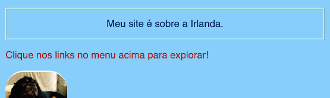
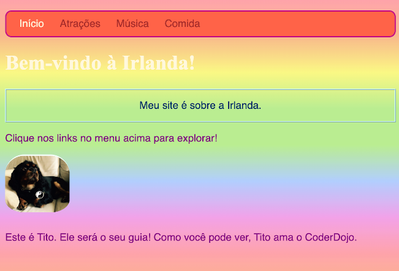
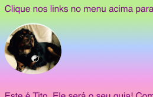

## Estilo individual

Vamos animar um pouco a página inicial! Com outro tipo de seletor de CSS, você pode aplicar um conjunto exclusivo de regras CSS a **um elemento específico**.

+ Vá para o `index.html` e encontre um elemento parágrafo (`p`), ou adicione um se você não tiver nenhum. Adicione o seguinte **atributo** para a tag:

```html
    <p id="myCoolText">
    Meu site é sobre a Irlanda.
    </p> 
```

O `id` é o nome que você atribui para um elemento específico para **identificá-lo**. Dois elementos numa página não devem ter o mesmo `id`!

+ Agora vá para a sua folha de estilos e adicione o seguinte código:

```css
    #myCoolText {
        color: #003366;
        border: 2px ridge #ccffff;
        padding: 15px;
        text-align: center;
    }
```

Seu texto deve ficar assim agora:



Um seletor com um `#` na frente dele é usado para aplicar regras de CSS a um elemento específico no seu site. Você especifica o elemento com a ajuda do nome que atribuiu ao atributo `id` do elemento.

+ Vamos fazer um para o `body` da página inicial. Vá para o `index.html` e adicione um `id` para a tag `body`.

```html
    <body id="frontPage">
```

+ Na folha de estilos, adicione as seguintes regras CSS:

```css
    #frontPage {
        background: #48D1CC;
        background: linear-gradient(#fea3aa, #f8b88b, #faf884, #baed91, #baed91, #b2cefe, #f2a2e8, #fea3aa);
    }
```

Você deve ver algo parecido com isso:



Você acabou de usar um **gradiente**! Esse é o nome dado ao efeito onde uma cor se encontra com uma outra. Nota: A primeira propriedade `background` acima do gradiente determina uma cor padrão para navegadores que não suportam gradientes.

Se você digitou o código perfeitamente e não obteve o adorável efeito arco-íris acima, pode ser que o seu navegador não suporte gradientes.

Você pode fazer muitos efeitos diferentes com gradientes. Se você quiser saber mais, clique [aqui](http://dojo.soy/html2-css-gradients){:target="_blank"}.

\--- challenge \---

## Desafio: estilize mais alguns elementos

+ Tente atribuir a outro elemento um `id` e estilize esse elemento usando o seletor de ID `#` como acima. Que tal fazer uma imagem ter um `border-radius` de `100%` para que seja totalmente arredondada? Quaisquer outras imagens no site permanecerão do mesmo jeito que estavam. 

\--- hints \---

\--- hint \---

Você atribui a um elemento um `id` adicionando o atributo `id` para a tag HTML, assim:

```html
          
```

Escolha qualquer nome que você quiser para o `id`.

\--- /hint \---

\--- hint \---

Para definir regras de estilo para um elemento específico, você deve usar o símbolo `#` e o nome que você deu ao elemento como seu `id`.

```css
  #titoPicture {
    border-radius: 100%;
  }
```

Nota: o nome que você digita na frente das regras CSS deve ser **exatamente** igual ao nome que você colocou no atributo `id` do elemento.

\--- /hint \---

\--- /hints \---



\--- /challenge \---