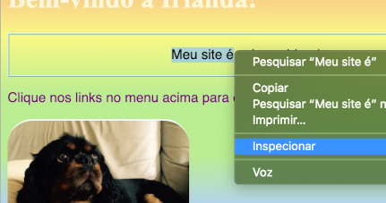
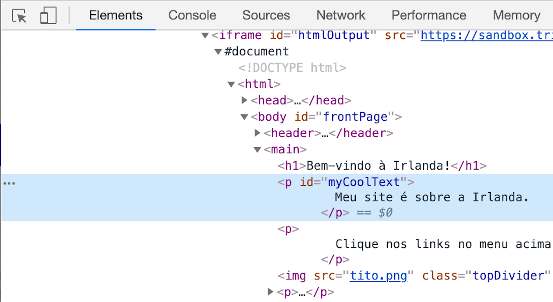
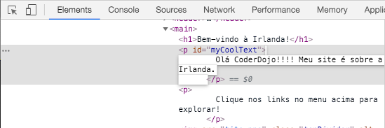
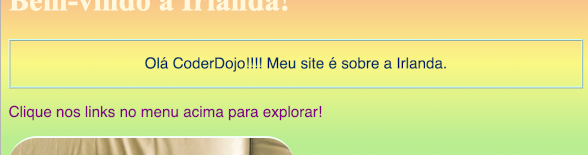
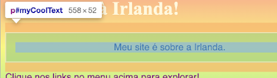
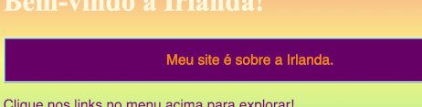

## Veja o código em outros sites!

**Nota:** Para completar esta etapa, você precisa usar um desses navegadores: Chrome, Firefox ou Internet Explorer/Edge. Se você não tem acesso a nenhum deles, você pode continuar no próximo cartão.

Com este cartão, você aprenderá a dar uma olhada no código de qualquer site usando a **ferramenta de inspeção**, e você também vai descobrir como fazer algumas mudanças que só você pode ver!

+ Antes de começar, certifique-se de que seu projeto está salvo. Então atualize seu site clicando no ícone de atualização no seu navegador.

+ Na sua página Web (a página, não o código), destaque o texto com a borda que você adicionou no cartão anterior, então clique com o botão direito do mouse e selecione a opção **Inspecionar** no menu que aparece. (A opção pode ser chamada de 'Inspecionar Elemento' ou similar, dependendo do navegador que você está usando. Se estiver com problemas para encontrar a opção, peça ajuda para alguém do seu Dojo.)



Uma caixa totalmente nova aparecerá no seu navegador com muitas abas e código: como **developer tools** ou a abreviação **dev tools**. Aqui você pode ver o código para aquilo em que você clicou, bem como o código para a página inteira!

### Inspecionando o código HTML

+ Procure pela aba que mostra o código HTML para a página (pode ser chamado de 'Elements' ou 'Inspector'). O código deve ter a mesma aparência de como você o digitou no seu arquivo HTML! Você pode clicar nos triângulos pequenos do lado direito para expandir o código que está oculto.



+ Clique duas vezes sobre o texto entre as tags. Você poderá editá-lo agora! Digite algo e pressione <kbd>Enter</kbd>.



+ Você vê a atualização de texto em seu site? Nota: apenas você pode ver essas alterações.



+ Agora **recarregue** a página e veja o que acontece. Suas alterações devem desaparecer!

+ No canto superior esquerdo da caixa de ferramentas do desenvolvedor, clique no ícone que se parece com um pequeno retângulo com uma seta. Agora você pode mover o cursor sobre a página da Web, e o inspetor de HTML mostrará o código que a descreve.

 

### Inspecionando o código CSS

+ Vamos dar uma olhada no código CSS a seguir. Procure a guia **Styles** nas ferramentas do desenvolvedor (pode ser chamado de 'Style Editor' ou algo semelhante). Você deve ver várias regras CSS, incluindo as que você criou para esse parágrafo, `#myCoolText`.


+ Nas regras `#myCoolText`, clique no valor ao lado da propriedade `color`. Tente digitar um valor diferente. Veja o texto da sua página da web mudar de cor imediatamente! 


Nota: você também pode clicar no quadrado colorido para alterar a cor usando uma ferramenta de seleção de cores.

+ Clique no espaço após a cor. Uma nova linha é iniciada, onde você pode digitar mais CSS. Digite o seguinte e pressione <kbd>Enter</kbd>:

```css
  background-color: #660066;
```

Você deve ver o plano de fundo mudar nesse pedaço de texto.

 

## \--- collapse \---

## title: Como isso funciona?

Quando você muda o código do site usando as ferramentas de desenvolvedor, você muda **temporariamente** como se parece **em seu navegador**. Na verdade, você não está alterando os arquivos que compõem o site.

Ao atualizar a página, você está carregando o site novamente a partir dos seus arquivos (na internet ou no seu computador). É por isso que suas alterações desaparecem.

Agora que você sabe disso, pode se divertir mexendo com o código em outros sites!

\--- /collapse \---

+ Tente usar essas ferramentas para olhar o código em outro site. Se quiser, você até pode fazer alterações! Lembre-se, apenas você pode ver as alterações que fizer, e tudo será redefinido quando você atualizar a página.