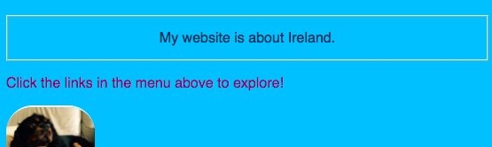
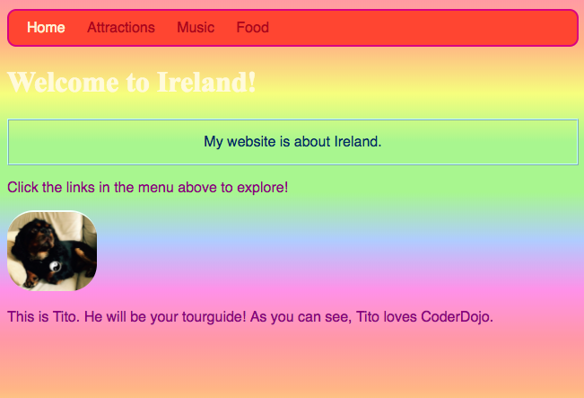

## Stilul individual

Hai să jazz pagina de start puțin! Cu un alt tip de selector CSS, puteți aplica un set unic de reguli CSS la doar **un element specific**.

+ Mergeți la `index.html` și găsiți un element de paragraf (`p`) sau adăugați un element dacă nu aveți niciun element. Adăugați următoarele **atributul** la tag - ul:

```html
    <p id="myCoolText">
        Site-ul meu este despre Irlanda.
    </p> 
```

`id` este un nume pe care îl dați un element particular pentru a **identifica** acesta. Nu există două elemente de pe o pagină ar trebui să aibă vreodată aceeași `id -`!

+ Acum mergeți la foaia dvs. de stil și adăugați următorul cod:

```css
    #myCoolText {culoare: # 003366; frontieră: 2px creasta #ccffff; padding: 15px; text-align: centru; }
```

Textul dvs. ar trebui să arate astfel:



Un selector cu `#` în fața acestuia este folosit pentru a aplica regulile CSS unui element specific pe site-ul dvs. Web. Specificați elementul cu ajutorul numelui căruia i-ați alocat atributul `id` al elementului.

+ Hai să facem unul pentru `corpul` al paginii de start. Mergeți la `index.html` și adăugați un `id` la eticheta `corp`.

```html
    <body id="frontPage">
```

+ În foaia de stil, adăugați următoarele reguli CSS:

```css
    #frontPage {background: # 48D1CC; fundal: gradient linear (# fea3aa, # f8b88b, # faf884, # baed91, # baed91, # b2cefe, # f2a2e8, # fea3aa); }
```

Ar trebui să obțineți ceva care arată astfel:



Tocmai ai folosit **gradient**! Acesta este numele dat efectului în care o culoare se estompează în alta. Notă: Prima `fundal` proprietate deasupra celui de gradient determină o culoare implicită pentru browserele care nu acceptă gradienti.

Dacă ați tastat perfect codul și nu ați obținut efectul curcubeu minunat de mai sus, este posibil ca browserul dvs. să nu accepte declivități.

Puteți face o mulțime de efecte diferite cu pante. Dacă doriți să aflați mai multe, mergeți aici [aici](http://dojo.soy/html2-css-gradients){: target = "_ blank"}.

\--- provocare \---

## Provocare: stil mai multe elemente

+ Încercați să dați un alt element `id` și să stylizați acel element utilizând selectorul de identificare cu `#` ca mai sus. Cum despre a face o imagine au un `border-radius` din `100%` astfel încât să fie pe deplin rotunjite? Orice alte imagini de pe site vor rămâne aceleași ca și ele. 

\--- sugestii \---

\--- hint \---

Dați un element `id` adăugând atributul `id` la eticheta HTML, după cum urmează:

```html
          
```

Alegeți orice nume `id` vă place.

\--- / indiciu \---

\--- hint \---

Pentru a defini reguli de stil pentru un anumit element, utilizați simbolul `#` și numele pe care l-ați dat elementului ca `id`.

```css
  #titoPicture {limita-raza: 100%; }
```

Notă: numele pe care îl tastați în fața regulilor CSS ar trebui **exact** meci numele pe care îl pune în elementului `id` atribut.

\--- / indiciu \---

\--- / sugestii \---


\--- /provocare \---