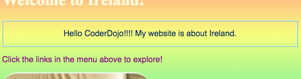
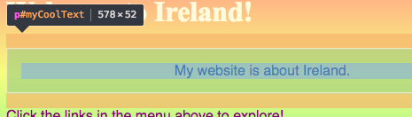
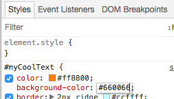

## Vezi codul de pe alte site-uri!

**Notă:** Pentru a finaliza acest pas, aveți nevoie de unul dintre aceste browsere web: Chrome, Firefox sau Internet Explorer / Edge. Dacă nu aveți acces la unul dintre ele, puteți continua cu următorul card.

Pe această carte veți învăța cum să se strecoare o privire la codul de orice site folosind **instrumentul inspector**, și veți găsi , de asemenea , cum să facă unele modificări pe care doar le puteți vedea!

+ Înainte de a începe, asigurați-vă că proiectul dvs. este salvat. Apoi, reîmprospătați site-ul dvs. Web făcând clic pe pictograma de actualizare din browserul dvs.

+ Pe pagina dvs. web (pagina actuală, nu codul) evidențiați textul cu marginea pe care ați adăugat-o pe cartela anterioară, apoi faceți clic dreapta pe el și selectați opțiunea **Inspectați** din meniul care apare. (Opțiunea ar putea fi numită "Inspect Element" sau similară, în funcție de browserul pe care îl utilizați. Dacă întâmpinați dificultăți în găsirea unei opțiuni de meniu, cereți-i pe cineva de la Dojo pentru ajutor.)


O casetă cu totul nouă va apărea în browserul dvs. web cu numeroase file și coduri: instrumentele **dezvoltatori**sau **instrumentele dev** pentru scurt. Aici puteți vedea codul pentru lucrul pe care ați făcut clic, precum și codul pentru întreaga pagină!

### Inspectarea codului HTML

+ Căutați fila care vă arată codul HTML pentru pagină (poate fi numit "Elemente" sau "Inspector"). Codul ar trebui să arate aproape la fel ca și modul în care l-ați introdus în fișierul HTML! Puteți să faceți clic pe triunghiurile mici din partea dreaptă pentru a extinde codul ascuns.


+ Faceți dublu clic pe text între etichete. Ar trebui să puteți să o editați acum! Introduceți ceva și apăsați <kbd>Introduceți</kbd>.


+ Vedeți actualizarea textului pe site-ul dvs.? Notă: numai dvs. puteți vedea aceste modificări.



+ Acum **Reîncărcați** pagina și urmăriți ce se întâmplă. Modificările dvs. ar trebui să dispară!

+ În colțul din stânga sus al casetei cu instrumente dev, faceți clic pe pictograma care arată ca un mic dreptunghi cu o săgeată. Acum puteți să vă mișcați cursorul peste pagina web, iar inspectorul HTML vă va afișa codul care îl descrie.

 

### Inspectarea codului CSS

+ Să aruncăm o privire la codul CSS următor. Căutați fila **Stiluri** în instrumentele dezvoltatorului (poate fi numită "Editor de stil" sau similar). Ar trebui să vedeți o grămadă de reguli CSS, inclusiv cele create pentru paragraful respectiv, `#myCoolText`.


+ În regulile `#myCoolText` , faceți clic pe valoarea de lângă proprietatea `color`. Încercați să introduceți o valoare diferită. Urmăriți imediat textul de pe pagina dvs. de schimbare a paginii web! 


Notă: de asemenea, puteți să faceți clic pe pătratul colorat pentru a schimba culoarea utilizând un instrument de selectare a culorii.

+ Faceți clic pe spațiul după culoare. O nouă linie începe, unde puteți introduce mai multe CSS. Introduceți următoarele și apăsați <kbd>Introduceți</kbd>:

```css
  fundal-culoare: # 660066;
```

Ar trebui să vedeți schimbarea de fundal a piesei respective.

 

## \--- colaps \---

## titlu: Cum funcționează?

Când schimbați codul site-ului folosind instrumentele de dezvoltator, sunteți **temporar** schimbând ceea ce pare **în browserul dvs.**. Nu modificați de fapt fișierele care alcătuiesc site-ul web.

Când actualizați pagina, încărcați din nou site-ul web din fișierele sale (pe internet sau pe computer). De aceea schimbările dvs. dispar.

Acum că știi asta, poți să te distrezi de cod pe alte site-uri web!

\--- / colaps \---

+ Încercați să utilizați aceste instrumente pentru a vedea codul pe un alt site web. Puteți face chiar modificări dacă doriți! Rețineți că numai dvs. puteți vedea modificările pe care le faceți și totul va reveni la reîmprospătarea paginii.