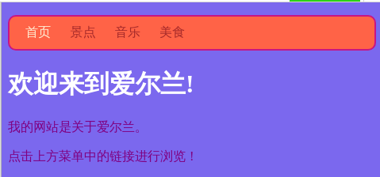

## 所有颜色！

正如你以前看到的那样，你可以输入许多不同的颜色名称作为单词，浏览器会识别它们。 但是更常见的设置颜色的方法是使用**十六进制代码** （“ hex”是**十六进制的缩写** ，一种特殊的计数方式）。

+ 查看您的**样式表**。 这是名字中有 `.css`的文件。

+ 在 `body`的 CSS 规则中，将背景颜色设置为十六进制代码`#7B68E`：

```html
  background-color: #7B68EE;
```

注意：如果使用的是Mac，则可以键入`＃ `通过按<kbd> alt </kbd>和<kbd> 3 </kbd>同时按键。

您的网站现在应该具有紫色背景。

 

+ 不是紫色的粉丝？ 转到[此网页](http://dojo.soy/html2-colors){:target="_blank"} 并为您的样式表选择另一种颜色 — 而不是输入颜色的名称。 输入十六进制代码。 


颜色代码允许您创建任何颜色，即使它不在任何颜色名称列表中。

+ 尝试创建您自己的彩色代码。 它必须以`＃开头` 。 这告诉浏览器这是一个十六进制代码，而不是颜色名称。 其余的代码由6个字符组成。 它们可以是** 0到9之间的任何数字**以及** A到F的任何字母** 。

## \--- collapse \---

## 标题：它是如何工作的？

每种颜色通过混合不同数量的**red**、**绿色**和**蓝色**来制作。 您有时会看到这个记录为 **RGB**。 这些颜色中的每一种都用你HEX代码中六位数字中的两位表示。 ` 00 `是最小值，并且` FF `是最大的。

**Hexadecimal**是一种计数方法，使用字母A-F作为额外数字使数字更短些。 数` 255 `被写为` FF `以十六进制表示。 你不需要担心学习用十六进制数字计数。 相反，尝试不同的十六进制代码来使用它们。

+ 这里有一些基本颜色可以在您的网站上试用。 尝试输入较小的数字而不是` FF `看看阴影如何变化。

|      | R  | G  | B  | 结果  |
| ---- | -- | -- | -- |:---:|
| \# | FF | 00 | 00 | 红色  |
| \# | 00 | FF | 00 | 绿色  |
| \# | 00 | 00 | FF | 蓝色  |
| \# | FF | FF | 00 | 黄色  |
| \# | FF | 00 | FF | 洋红色 |
| \# | 00 | FF | FF | 蓝绿  |
| \# | FF | 8c | 00 | 深橙色 |

\--- /collapse \---

混合完美颜色可能需要大量实验。 幸运的是，有很多在线颜色选择工具可以帮助您获取所需颜色的十六进制代码。


+ 试用[此颜色选择器](http://dojo.soy/html2-color-picker) {：target =“ _ blank”}，以选择一些十六进制颜色代码以用于网站上的其他样式。