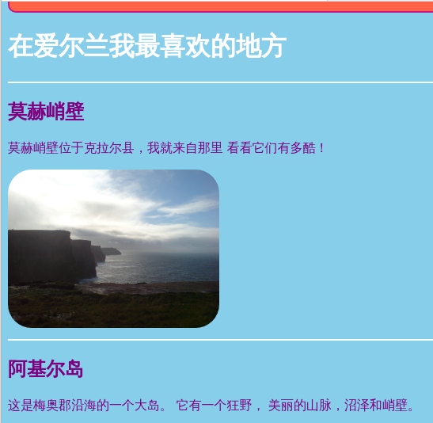
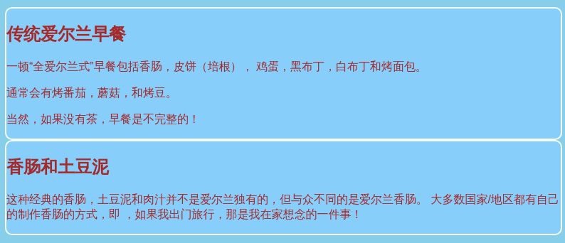
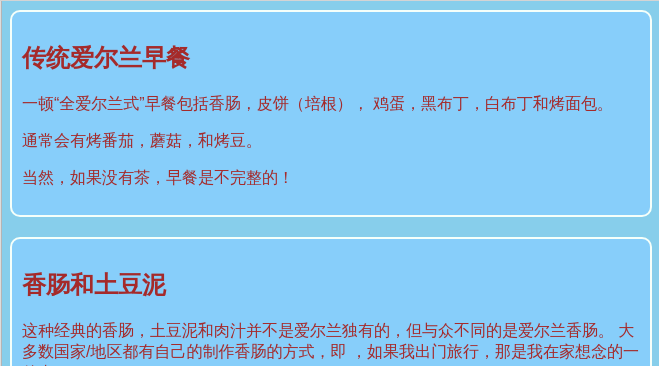
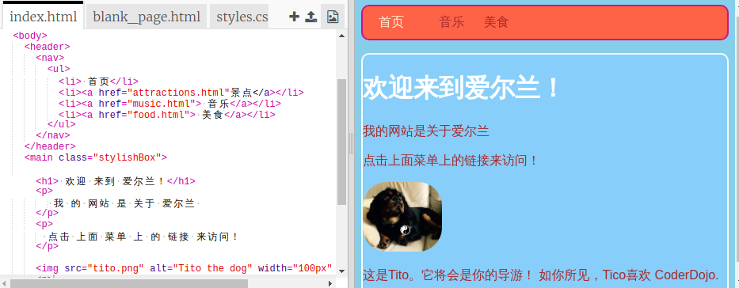

## 设计一些主题

为诸如 `section` 和 `p` 等元素编写CSS规则很棒，但是如果您想使它们中的一些看起来与众不同怎么办？ 在这张卡片上，您将学习如何对同类元素应用不同的样式规则，并在您的网站上为每个页面创建一个不同的主题！

+ 转到样式表文件并添加以下内容-确保在前面加上点！

```css
  .topDivider {
    border-top-style: solid;
    border-top-width: 2px;
    border-top-color: #F5FFFA;
    padding-bottom: 10px;
  }
```

+ 现在转到` attractions.html ` （如果您使用自己的项目，则为正在处理的HTML文件），然后添加以下** attribute **到每个` section `标签：

```html
  <section class="topDivider">
```

您应该在页面的每个部分上方看到一行。 祝贺您-您刚刚使用了第一个** CSS类** ！



+ 查看您的网页现在是如何看的，并将其与其他有` section `元素的页面进行比较。 您会看到只有那些添加了属性` class =“ topDivider”的属性`将在最上面。

## \--- collapse \---

## 标题：它是如何工作的？

请记住，当您使用CSS ** 选择器 **如` section `或` p `或` nav ul ` ，样式规则适用于** all **您网站上该类型的元素。

使用 CSS ** 类 **, 你能够更改一些元素的风格。

将点置于您的选择器前面，使它变成一个**类选择器**。 一个类可以有任何名称，因此它不必是 HTML 元素的名称。 例如：

```css
  .myAwesomeClass {
    /* my cool style rules go here */
  }
```

要选择样式规则应用于哪些元素，请添加` 类 ` ** 属性 **到HTML代码中的那些元素：将类的名称作为属性的值，**不带**点，像这样：

```html
  class="myAwesomeClass"
```

\--- /collapse \---

+ 准备尝试另一堂课吗？ 将下面的样式添加到`styles.css`

```css
  .stylishBox {
    background-color: #87CEFA;
    color: #A52A2A;
    border-style: solid;
    border-width: 2px;
    border-color: #F5FFFA;
    border-radius: 10px;
  }
```

+ 然后，在您网站的其他页面上，将该类添加到那里的某些元素中。 我将把它添加到我网站食物页面的`部分` 中，就像这样： `<section class="stylishBox">`。

看起来不错，但现在我的各个部分都被压在一起了。



您可以随意将尽可能多的 CSS 类应用于某个元素。 只需在`类`属性中写下您想要使用的所有类的名称(请记住，没有点！)，用空格分隔它们。

+ 让我们创建另一个CSS类，为各部分提供一些边距和填充。 在` styles.css中`文件，创建以下CSS类：

```css
  .someSpacing {
    padding: 10px;
    margin-top: 20px;
  }
```

+ 在你的`html`代码中，将新类添加到你正在处理的每个元素中，例如：

```html
  <section class="stylishBox someSpacing">
```



因此CSS类让您**选择**样式哪些元素，它们可以让您**重用**您想要的任何元素上具有相同的样式规则集。

+ 转到` index.html `并添加` stylishBox ` `主类`元素或页面上的另一个元素。 之后您可以再次将其删除！

```html
    <main class="stylishBox">   
```

这是我的 CSS 类的主页。 我还将`topDivider`类添加到Tito图片的`img`标签中。



\--- challenge \---

## 挑战：做一些更改

+ 使用CSS **类**为您的网站定义一些不同的图片大小，例如` .smallPictures `和` .mediumPictures ` 。 然后从您的`img`元素中删除`width`属性，然后添加相应的类。

\--- hints \---

\--- hint \---

您可以创建一个CSS类，该类仅定义元素的宽度，如下所示：

```css
  .smallPictures {
    width: 100px;
  }
```

\--- /hint \---

\--- hint \---

这里有一个`img`标签，带有`宽`属性：

```html
         
```

当您移除`width`属性并使用CSS类控制大小时，它看起来就像这样：

```html
         
```

通过使用CSS类，只需更改样式表中的一行代码，即可轻松地一次更改所有图片的宽度！

\--- /hint \---

\--- /hints \---

\--- /challenge \---