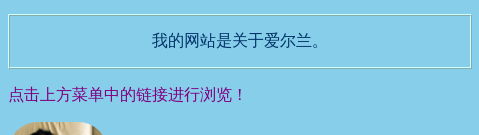
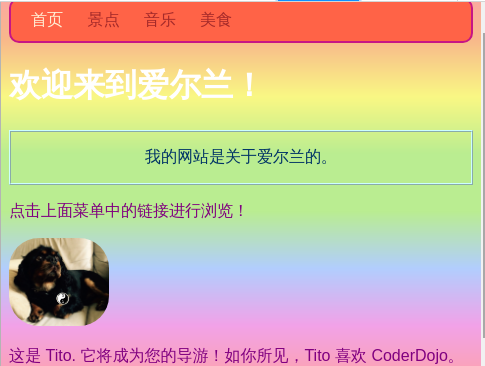
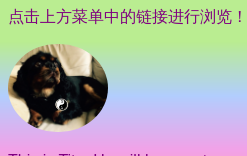

## 单个样式

让我们看看主页！ 使用另一种CSS选择器，您可以将一组唯一的CSS规则应用于**一个特定元素** 。

+ 转到` index.html `并找到一个段落（` p ` ）元素，如果没有则添加一个。 添加以下**属性**到标签：

```html
    <p id="myCoolText">
    我的网站关于爱尔兰 。
    </p> 
```

`id`是你给**特定**元素的名称。 页面上不应该有两个元素相同的`id`!

+ 现在转到您的样式表并添加以下代码：

```css
    #myCoolText {
        color: #003366;
        border: 2px ridge #ccffff;
        padding: 15px;
        text-align: center;
    }
```

你的代码应该像这样：



一个在网站前面有 `#` 的选择器用于对您网站上的一个特定元素应用CSS 规则。 您在指定元素的`id`属性的名称帮助下指定元素。

+ 让我们为主页的` body `做一个。 转到` index.html `并添加一个` id `到`body` 标签。

```html
    <body id="frontPage">
```

+ 在样式表中，添加以下CSS规则：

```css
    #frontPage {
        background: #48D1CC;
        background: linear-gradient(#fea3aa, #f8b88b, #faf884, #baed91, #baed91, #b2cefe, #f2a2e8, #fea3aa);
    }
```

你应该看到类似下面的内容：



您刚刚使用了**渐变** ！ 这是指一种颜色转向另一种颜色时的名称。 注意：第一个`背景`渐变上方的属性确定了不支持渐变的浏览器的默认颜色。

如果您完美地键入了代码，但是上面没有得到漂亮的彩虹效果，则可能是您的浏览器不支持渐变。

您可以使用渐变来制作许多不同的效果。 如果您想了解更多，请在这里[ ](http://dojo.soy/html2-css-gradients) {：target =“ _ blank”}。

\--- challenge \---

## 挑战：设计更多元素

+ 尝试给另一个元素一个` id `并使用ID选择器和`＃对该元素进行样式设置`如上。 如何制作一张图片`边界半径``100%`，以便它完全旋转？ 网站上的任何其他图片将保持不变。 

\--- hints \---

\--- hint \---

您给元素一个` id `通过添加` id ` HTML标签的属性，如下所示：

```html
          
```

选择任何` id `喜欢的名字

\--- /hint \---

\--- hint \---

要为特定元素定义样式规则，请使用`＃ `符号，以及您为元素指定的名称作为其` id ` 。

```css
  #titoPicture {
    border-radius: 100%;
  }
```

注意：您在 CSS 规则前输入的名称应**精确** 匹配您在 `id`属性中的名称。

\--- /hint \---

\--- /hints \---



\--- /challenge \---