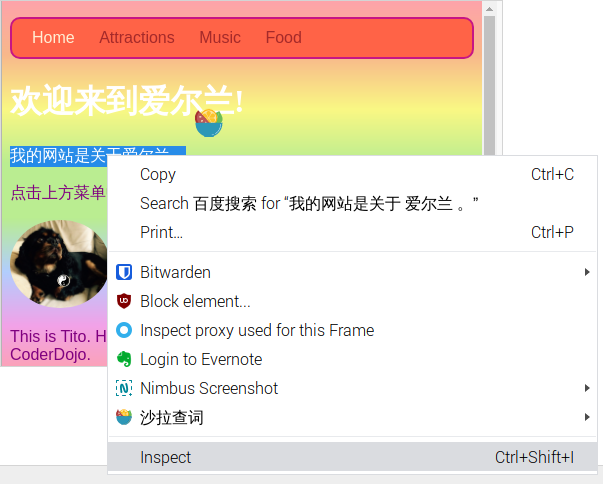
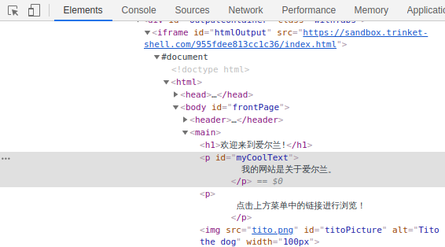
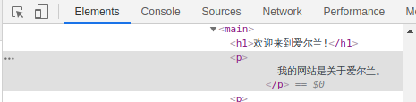
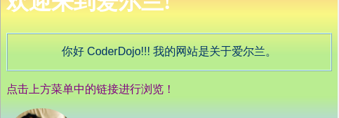
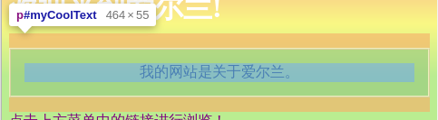
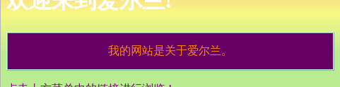

## 查看其他网站上的代码！

**注意：** 要完成这一步，您需要使用其中一个浏览器：Chrome、Firefox或Internet Explorer/Edge。 如果您无权访问其中之一，则可以继续使用下一张卡。

在这张卡片上，您将会学习如何在任何网站的代码中使用**检查器工具**， 你也会发现如何做一些只有你能看到的更改！

+ 在您开始之前，请确保您的项目已保存。 然后通过单击浏览器中的刷新图标来刷新您的网站。

+ 在您的网页（实际页面，而不是代码）上，突出显示您在上一张卡片上添加边框的文本，然后右键单击该文本并选择选项**检查**从出现的菜单中。 （根据您使用的浏览器，该选项可能称为“检查元素”或类似名称。 如果您找不到菜单选项，只需向Dojo的某人寻求帮助。）



全新的框将出现在您的网页浏览器中，包含大量标签和代码： **开发者工具**, 或**dev 工具** 。 在这里，您可以查看单击的内容的代码以及整个页面的代码！

### 检查HTML代码

+ 寻找显示页面的 HTML 代码的标签(它可以叫做“元素” 或 “检查器”)。 该代码看起来应该与您在HTML文件中键入代码的方式几乎相同！ 您可以单击右侧的小三角形以展开隐藏的代码。



+ 双击标签之间的文本。 您现在应该可以对其进行编辑！ 输入内容，然后按<kbd> Enter </kbd> 。



+ 您在网站上看到文本更新吗？ 注意：只有您可以看到这些更改。



+ 现在**重新加载**在页面上，看看会发生什么。 您的更改将消失！

+ 在开发工具框的左上角，单击看起来像带有箭头的小矩形的图标。 现在，您可以将光标移到网页上，HTML检查器将向您显示描述它的代码。

 

### 检查CSS代码

+ 接下来让我们看一下CSS代码。 寻找**样式**开发人员工具中的“标签”（可能称为“样式编辑器”或类似名称）。 您应该看到一堆CSS规则，包括您为该段创建的规则，` #myCoolText ` 。


+ 在` #myCoolText中`规则，单击`颜色旁边的值`属性。 尝试输入不同的值。 观看网页上的文字立即更改颜色！ 


注意：您也可以单击彩色正方形以使用颜色选择器工具更改颜色。

+ 单击颜色后面的空格。 新行开始，您可以在其中键入更多CSS。 输入内容，然后按<kbd> Enter </kbd> 。

```css
  background-color: #660066;
```

您应该看到该文本的背景变化。

 

## \--- collapse \---

## 标题：它是如何工作的？

当您使用开发者工具更改网站代码时，您将**在您的浏览器**中更改它看起来像的**临时内容**。 您实际上并没有更改构成网站的文件。

刷新页面时，您正在从网站文件中重新加载网站（在Internet或计算机上）。 这就是为什么你的更改消失了。

现在您已经知道了，您可以将其他网站上的代码弄得很有趣！

\--- /collapse \---

+ 尝试使用这些工具在另一个网站上查看代码。 如果你喜欢，你甚至可以进行更改！ 请记住，只有您可以看到您所做的更改，当您刷新页面时，一切都会重置。